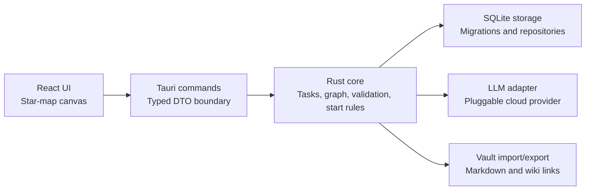

# MindLattice Architecture

## Architectural Principles

MindLattice uses a shared-core, independent-interface architecture.

The Rust core owns product logic. The desktop UI owns presentation and interaction. Storage owns persistence. AI adapters own model transport. This keeps the first desktop app practical while preserving a path to future mobile or web interfaces.

## High-Level Diagram



## Planned Repository Structure

```text
MindLattice/
  apps/
    desktop/
      src/
      src-tauri/
  crates/
    core/
    storage/
    ai/
    vault/
  docs/
    product.md
    architecture.md
    development-plan.md
```

The current repository starts with documentation only. The code structure above should be created during the implementation phases.

## Desktop UI

Technology:

- Tauri 2 for the desktop shell.
- React and Vite for UI.
- React Flow for graph rendering and node-edge interaction.
- TypeScript DTOs generated or manually kept in sync with Rust DTOs.

Responsibilities:

- Render the star-map canvas.
- Handle selection, drag, drop, viewport controls, and editing panels.
- Call Tauri commands for all mutations.
- Show AI proposals as reviewable suggestions.
- Keep UI state separate from persisted domain state.

Non-responsibilities:

- Direct SQLite access.
- Domain validation.
- AI provider-specific transport.
- Import/export parsing.

## Rust Core

The core crate should be pure Rust and should not depend on Tauri. It should define the stable domain model and behavior used by any future interface.

Core responsibilities:

- Validate graph nodes and edges.
- Enforce node and edge kinds.
- Manage decomposition proposals.
- Convert accepted proposals into graph mutations.
- Generate deterministic next-action suggestions when AI is unavailable.
- Keep product safety constraints centralized.

Important DTOs:

- `Workspace`
- `GraphNode`
- `GraphEdge`
- `MapSnapshot`
- `DecompositionRequest`
- `DecompositionProposal`
- `NextActionSuggestion`
- `VaultImportResult`
- `VaultExportResult`
- `LlmSettings`

## Storage

SQLite is the source of truth for the first version.

Core tables should cover:

- `workspaces`
- `nodes`
- `edges`
- `node_notes`
- `ai_proposals`
- `settings`

All persisted entities should use UUIDs. Nodes and edges should include `created_at`, `updated_at`, and nullable `deleted_at` fields. A `version` field should be reserved for future sync or conflict handling, but MVP should not implement cloud sync.

The UI must receive storage data through core-facing DTOs, not raw database rows.

## AI Adapter

AI integration should be pluggable.

The core should depend on an interface similar to:

```rust
pub trait LlmProvider {
    async fn decompose(&self, request: DecompositionRequest) -> Result<DecompositionProposal, LlmError>;
}
```

The first adapter should support a configurable cloud model endpoint:

- `base_url`
- `api_key`
- `model`
- request timeout

The returned proposal must be validated before display:

- Maximum 7 proposed nodes.
- Maximum 10 proposed edges.
- Maximum 3 next actions.
- No medical diagnosis or treatment guidance.
- No direct persistence until user acceptance.

## Vault Import and Export

Vault compatibility is manual import/export only in the first version.

Import:

- Read Markdown files from a user-selected folder.
- Parse YAML frontmatter when present.
- Extract title from frontmatter, first heading, or filename.
- Preserve body as note content.
- Convert `[[wiki links]]` into related edges when both sides can be resolved.

Export:

- Write one Markdown file per node.
- Use readable filenames derived from node titles.
- Include frontmatter with MindLattice metadata.
- Include backlinks or relationship summaries in the body when useful.

SQLite remains authoritative after import. Export is a snapshot, not live sync.

## Tauri Command Boundary

Initial commands:

- `workspace_open_default`
- `map_get`
- `node_create`
- `node_update`
- `node_move`
- `edge_create`
- `edge_delete`
- `decompose_preview`
- `decompose_accept`
- `next_action_suggest`
- `vault_import`
- `vault_export`
- `settings_update_llm`

Commands should return typed success values or structured errors. User-facing error messages should be short and actionable.

## Future Platform Path

The first version is desktop-only, but the architecture should preserve future options:

- Mobile UI can call the same Rust core through a Tauri mobile path or FFI wrapper.
- A web version could reuse DTOs and some interaction design, but should not drive the initial architecture.
- Sync can be added later by using reserved entity versioning and origin metadata.

## Security and Privacy

- Local data should stay local by default.
- AI calls should be opt-in and disabled until settings are configured.
- API keys should be stored through platform-appropriate secure storage when implementation reaches that stage.
- Exported Markdown may contain sensitive user data and should be treated as user-controlled output.
