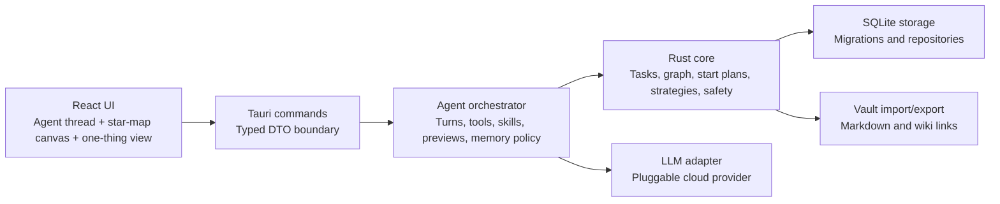

# MindLattice Architecture

| Field | Value |
| --- | --- |
| Status | Draft |
| Owner | Engineering |
| Last updated | 2026-05-17 |
| Scope | MVP and first release technical architecture |

## Principles

MindLattice uses a shared-core, independent-interface architecture.

- The Rust core MUST own product logic, graph rules, start-plan generation, support templates, proposal validation, and safety boundaries.
- The agent layer MUST own conversational turn orchestration, tool routing, skill selection, preview state, prompt assembly, and confirmed memory policy.
- The desktop UI MUST own presentation and interaction only.
- Storage MUST own persistence and migrations.
- LLM adapters MUST own model transport and provider-specific request handling.
- Vault import/export MUST remain manual snapshot interoperability for the first release.

## System Overview



## Repository Structure

The implementation SHOULD use this structure:

```text
MindLattice/
  apps/
    desktop/
      src/
        app/
        features/
          capture/
          agent/
          map/
          start-mode/
          strategies/
          check-ins/
          settings/
        shared/
          api/
          components/
          styles/
      src-tauri/
  crates/
    core/
      src/
        domain/
        graph/
        start_plan/
        strategies/
        safety/
        proposals/
    agent/
      src/
        loop/
        tools/
        skills/
        prompts/
        memory/
        previews/
    storage/
      migrations/
      src/
    ai/
      src/
    vault/
      src/
  docs/
```

The current repository contains the first Rust workspace scaffold for `crates/core`, `crates/storage`, `crates/ai`, `crates/agent`, `crates/vault`, and `apps/desktop/src-tauri`, plus a React/Vite desktop UI scaffold under `apps/desktop/src`. `crates/ai` includes API-mode-specific provider transports for OpenAI Chat Completions compatible, OpenAI Responses compatible, Claude Messages compatible, and Google Gemini native `generateContent`; the desktop command runtime can load saved provider settings for live agent turns.

## Boundaries

### Desktop UI

Technology:

- Tauri 2.
- React and Vite.
- React Flow.
- TypeScript DTOs generated from or manually synchronized with Rust DTOs.

Responsibilities:

- Render the star-map canvas.
- Render the conversational execution agent thread.
- Render low-stimulus Start Mode.
- Handle selection, drag, drop, viewport controls, and editing panels.
- Call typed Tauri commands for all mutations.
- Show agent proposals as reviewable previews.
- Let users revise active previews in natural language.
- Show local strategy cards, support templates, environmental adjustments, and follow-up prompts.

Non-responsibilities:

- Direct SQLite access.
- Domain validation.
- LLM provider transport.
- Agent tool routing or prompt assembly.
- Import/export parsing.

Feature folders under `apps/desktop/src/features` MUST follow user workflows:

- `capture`: quick capture and first task creation.
- `agent`: natural-language execution thread, preview review, revision, and confirmation.
- `map`: star-map rendering, node editing, edge editing, and inspector surfaces.
- `start-mode`: one-thing view, start checks, attention session display, and return cue display.
- `strategies`: support template browsing, adoption, and strategy experiment review.
- `check-ins`: lightweight follow-up prompts and saved check-ins.
- `settings`: LLM provider setup and local preference controls.

### Rust Core

The core crate MUST be pure Rust and MUST NOT depend on Tauri.

Responsibilities:

- Validate graph nodes and edges.
- Enforce node and edge kinds.
- Manage decomposition proposals.
- Convert accepted proposals into graph mutations.
- Generate start plans from graph context.
- Provide local strategy cards and support templates.
- Record strategy experiments as personal execution preferences, not clinical outcomes.
- Generate attention sessions and start checks from a selected next action.
- Detect proposal safety violations before display or persistence.

### Agent Orchestrator

The agent crate MUST be pure Rust and MUST NOT depend on Tauri. It owns the conversational execution loop but MUST NOT directly write raw database rows.

Responsibilities:

- Maintain bounded agent turns using observe, classify, plan, act, review, respond, and remember.
- Assemble prompt layers from versioned prompt files and runtime context.
- Select product-level agent skills.
- Route tool calls through core-facing tool contracts.
- Maintain active preview state for map, start-plan, support, check-in, strategy-experiment, and memory proposals.
- Apply tool-call budgets, timeout budgets, stop conditions, and structured error handling.
- Enforce confirm-before-write for graph changes, support adoption, check-ins, strategy experiments, and preference memory.
- Store accepted agent events and previews through storage repositories, not raw SQL from the UI.

The agent orchestrator MAY call the LLM adapter multiple times in one turn when the tool budget allows it. It MUST surface a concise partial result or recovery message when the budget, timeout, provider, or safety review prevents completion.

### Storage

SQLite is the source of truth for the first release. The UI MUST receive storage data through core-facing DTOs, not raw database rows.

### LLM Adapter

LLM integration MUST be pluggable and required for the primary conversational execution agent. If no LLM provider is configured, the app MAY show setup, settings, existing stored data, and manual data review surfaces, but it SHOULD NOT promise the primary execution-scaffolding workflow.

`LlmSettings` MUST carry the provider and transport shape explicitly:

- `provider_id`
- `api_mode`
- `base_url`
- `api_key`
- `model`
- `timeout_seconds`

Supported first-release provider IDs are `openai`, `anthropic_claude`, `google_gemini`, `ollama_local`, and `custom`. Supported first-release API modes are `openai_chat_completions`, `openai_responses`, `claude_messages`, and `gemini_generate_content`.

The frontend MAY apply provider presets, but it MUST NOT assemble provider-specific request payloads or endpoint paths. Rust adapters in `crates/ai` own URL composition, headers, payload shape, and response parsing for each API mode. Claude adapters MUST provide a default `anthropic-version` header internally. Google Gemini native adapters MUST call model `:generateContent` endpoints and authenticate with the configured key.

Legacy saved settings without `provider_id` or `api_mode` MUST migrate to `openai` plus `openai_chat_completions` so existing OpenAI-compatible settings remain usable.

### Vault Adapter

Vault compatibility MUST be manual import/export only. SQLite remains authoritative after import or export.

## Domain Model

Important DTOs:

- `Workspace`
- `GraphNode`
- `GraphEdge`
- `MapSnapshot`
- `NodeExecutionMetadata`
- `DecompositionRequest`
- `DecompositionProposal`
- `AgentTurnRequest`
- `AgentTurnResponse`
- `AgentIntent`
- `AgentActionPlan`
- `AgentToolCall`
- `AgentPreview`
- `AgentSkillSpec`
- `AgentSkillRun`
- `PromptVersion`
- `SessionMemory`
- `PreferenceMemoryItem`
- `MemoryProposal`
- `NextActionSuggestion`
- `StartPlan`
- `StrategyCard`
- `SupportTemplate`
- `StrategyExperiment`
- `AttentionSession`
- `ContextProfile`
- `SafetyReview`
- `VaultImportResult`
- `VaultExportResult`
- `LlmSettings`

`AgentIntent` MUST support:

- `capture_task`
- `decompose_or_revise_map`
- `find_blocker`
- `find_next_action`
- `draft_start_plan`
- `revise_preview`
- `record_check_in`
- `record_strategy_experiment`
- `propose_preference_memory`
- `import_or_export`
- `general_question`
- `safety_redirect`

`AgentPreview` MUST support:

- Proposed node and edge creations.
- Proposed node and edge edits.
- Proposed support adoption.
- Proposed start plan.
- Proposed check-in.
- Proposed strategy experiment.
- Proposed preference-memory update.
- Validation status and safety review.
- User-visible explanation of what will change if accepted.

`AgentSkillSpec` MUST include:

- `id`
- `version`
- trigger conditions.
- required context.
- allowed tools.
- output schema.
- safety restrictions.
- example inputs and outputs.
- golden test cases.

`PreferenceMemoryItem` MUST include:

- `id`
- preference text or structured preference.
- evidence reference, such as accepted check-in or strategy experiment id.
- created and updated timestamps.
- user-visible enabled or disabled state.
- nullable deleted timestamp.

`GraphNode.kind` MUST support:

- `task`
- `subtask`
- `blocker`
- `note`
- `resource`
- `next_action`
- `support`
- `environment_adjustment`
- `routine_anchor`
- `attention_guard`
- `check_in`

The implementation MAY use a single `support` node plus `support_kind` metadata for support-related concepts. Command DTOs MUST still expose product concepts clearly.

`NodeExecutionMetadata` MUST cover:

- `energy_level`
- `friction_level`
- `estimated_minutes`
- `minimum_done`
- `context_tags`
- `last_started_at`
- `last_checked_in_at`

`SupportTemplate` MUST include:

- `id`
- `category`: `sensory_environment`, `task_structure`, `external_memory`, `written_communication`, `rest_and_switching`, or `work_study_adjustment`
- `title`
- `steps`
- `default_contexts`
- `source_note`
- `safety_note`

`StrategyExperiment` MUST include:

- `id`
- `support_template_id` or custom support reference.
- `context`: work, study, home responsibility, personal project, or custom.
- `helped_start`, `helped_continue`, `helped_return`, and `helped_clarify_next_action`.
- `obstacle_note`.
- `next_decision`: `keep`, `revise`, `pause`, or `remove`.

`ContextProfile` MUST include only lightweight preference defaults:

- Adult context choices.
- Common execution difficulty choices.
- Preferred support categories.
- LLM provider setup state.

`StartPlan` MUST include:

- Selected `next_action`.
- Parent task.
- Up to three support items.
- One optional environmental adjustment.
- Current blocker when available.
- Minimum-done definition.
- Estimate in minutes when available.
- Return cue.
- Start check fields: needed materials, current distraction, five-minute fit, and reopen target.
- Optional five-minute timer state.

`AttentionSession` MUST include:

- `id`
- Linked `start_plan_id` or selected `next_action` id.
- `started_at` and optional `ended_at`.
- Intended duration in minutes.
- Session state: `planned`, `active`, `paused`, or `closed`.
- Optional completion or interruption note.

`StrategyCard` MUST include:

- `id`
- `title`
- `when_to_use`
- `steps`
- `source_note`
- `safety_note`

## Storage

Core tables MUST cover:

- `workspaces`
- `nodes`
- `edges`
- `node_notes`
- `node_execution_metadata`
- `support_templates`
- `strategy_experiments`
- `attention_sessions`
- `ai_proposals`
- `check_ins`
- `context_profiles`
- `agent_threads`
- `agent_turns`
- `agent_previews`
- `agent_skill_runs`
- `preference_memory`
- `prompt_versions`
- `settings`

All persisted entities MUST use UUIDs. Nodes and edges MUST include `created_at`, `updated_at`, and nullable `deleted_at` fields. Node execution metadata SHOULD be optional so simple notes and resources stay lightweight.

Static support templates MAY be stored as seeded rows or returned from code. Accepted user supports and experiments MUST be persisted. A `version` field SHOULD be reserved for future sync or conflict handling, but the MVP MUST NOT implement cloud sync.

Agent turns and previews SHOULD be persisted enough to support review, revision, and debugging. Raw LLM provider payloads MAY be stored only when the user enables diagnostic logging. Preference memory MUST be inspectable, editable, and deletable.

## Commands

Initial Tauri commands:

- `workspace_open_default`
- `map_get`
- `node_create`
- `node_update`
- `node_move`
- `edge_create`
- `edge_delete`
- `start_plan_get`
- `check_in_create`
- `strategy_cards_list`
- `support_templates_list`
- `support_adopt`
- `strategy_experiment_create`
- `attention_session_start`
- `attention_session_close`
- `context_profile_get`
- `context_profile_update`
- `agent_turn_submit`
- `agent_preview_get`
- `agent_preview_accept`
- `agent_preview_reject`
- `agent_memory_list`
- `agent_memory_update`
- `agent_memory_delete`
- `vault_import`
- `vault_export`
- `settings_get_app`
- `settings_update_interface`
- `settings_update_llm`

Command responsibilities:

- `start_plan_get` returns one startable plan generated from the selected task or next action.
- `check_in_create` records a lightweight follow-up without streak counters.
- `strategy_cards_list` returns local static strategy cards and requires no network access.
- `support_templates_list` returns local support templates grouped by category and requires no network access.
- `support_adopt` creates a user-editable support node from a template.
- `strategy_experiment_create` records whether a support helped the user start, continue, return, or clarify the next action.
- `attention_session_start` and `attention_session_close` track a start session without productivity scoring.
- `context_profile_update` stores onboarding preferences and MUST NOT store clinical assessments or symptom scores.
- `agent_turn_submit` runs one bounded conversational agent turn and returns a natural-language response plus any structured preview.
- `agent_preview_accept` converts accepted preview operations into validated core mutations.
- `agent_preview_reject` closes an active preview without mutating persisted graph data.
- `agent_memory_list`, `agent_memory_update`, and `agent_memory_delete` expose preference memory management.
- `settings_get_app` returns saved LLM settings plus interface preferences from SQLite.
- `settings_update_interface` persists theme and language preferences using validated enum values.

Commands MUST return typed success values or structured errors. User-facing error messages SHOULD be short and actionable.

## Agent Tools

The agent MUST call tools through typed contracts. Tools MUST expose structured input and output schemas and MUST NOT give the LLM direct database access.

Initial tools:

- `map.summarize`
- `map.propose_nodes_edges`
- `map.revise_preview`
- `proposal.validate`
- `proposal.accept`
- `support.search_templates`
- `start_plan.generate`
- `check_in.propose`
- `strategy_experiment.propose`
- `memory.retrieve_preferences`
- `memory.propose_update`
- `safety.review`
- `vault.preview_import`

Write-capable tools MUST require explicit preview acceptance. The agent MAY prepare a write proposal during a turn, but the write MUST be executed only by a user confirmation command.

## Agent Skills and Prompts

Product-level agent skills MUST live as versioned specs under the agent crate or an adjacent prompt asset directory. The first release MUST include these skills:

- `capture_messy_task`
- `decompose_to_star_map`
- `identify_blockers`
- `find_smaller_next_action`
- `match_support_template`
- `draft_start_plan`
- `revise_graph_preview`
- `summarize_check_in`
- `extract_preference_from_experiment`
- `safe_redirect_for_crisis_or_medical_content`

Prompt layers MUST be assembled in this order:

1. System policy prompt.
2. Agent role prompt.
3. Workflow prompt.
4. Tool contract prompt.
5. Skill prompt.
6. Output style prompt.
7. Runtime context.

Prompt versions MUST be recorded with agent turns so behavioral changes can be traced.

## LLM Adapter and Safety

The core SHOULD depend on this provider interface shape:

```rust
pub trait LlmProvider {
    async fn complete_structured(&self, request: LlmStructuredRequest) -> Result<LlmStructuredResponse, LlmError>;
}
```

Provider adapters SHOULD support:

- `provider_id`
- `api_mode`
- `base_url`
- `api_key`
- `model`
- request timeout

The current crate implementation uses the same structured provider contract with a synchronous blocking transport until the runtime boundary is ready for async provider execution.

First-release API modes MUST map to these endpoint defaults:

- `openai_chat_completions`: append `/chat/completions`.
- `openai_responses`: append `/responses`.
- `claude_messages`: append `/messages`.
- `gemini_generate_content`: append `/models/{model}:generateContent`.

Returned agent outputs MUST be validated before display:

- Maximum 7 proposed nodes.
- Maximum 10 proposed edges.
- Maximum 3 next actions.
- No medical diagnosis or treatment guidance.
- No medication advice, symptom scoring, or treatment planning.
- No evaluation of whether the user has ADHD or how severe symptoms are.
- No claim that a strategy is clinically indicated for a specific user or will reduce ADHD symptoms.
- No ordinary productivity response to self-harm, severe crisis, substance-use risk, mania, or psychosis language.
- No direct persistence until user acceptance.

`SafetyReview.status` MUST include:

- `allowed`
- `blocked_medical`
- `blocked_crisis`
- `blocked_limits`

Crisis detection MAY use conservative keyword and phrase rules in the first release. This is a product safety boundary, not a clinical classifier.

## Agent Failure Handling

The agent MUST handle:

- Missing or invalid LLM provider settings by routing the user to setup.
- Provider timeout.
- Provider refusal or malformed structured output.
- Tool budget exhaustion.
- Safety-blocked output.
- Preview conflict with changed graph data.

Failure responses MUST be short, actionable, and honest about whether the agent could complete the turn.

## Vault Import and Export

The desktop shell uses Tauri dialog and filesystem plugins to let the user pick an import or export folder. Folder import only stages Markdown files into the existing preview flow; the SQLite graph changes only after the user accepts the preview. Folder export writes the current `vault_export` snapshot files to the selected folder.

Import MUST:

- Read Markdown files from a user-selected folder.
- Parse YAML frontmatter when present.
- Accept LF and CRLF Markdown line endings.
- Decode common escape sequences in double-quoted YAML values.
- Ignore YAML inline comments outside quoted values.
- Parse literal and folded YAML block scalar values for text fields.
- Preserve quoted commas in YAML inline and block-list `context_tags`.
- Extract title from frontmatter, first heading, or filename.
- Resolve duplicate imported titles and generated IDs with deterministic numeric suffixes.
- Preserve body as note content.
- Convert `[[wiki links]]` into `related` edges when both sides can be resolved.
- Convert exported relationship-summary links into typed edges when both sides can be resolved.

Export MUST:

- Write one Markdown file per node.
- Use readable filenames derived from node titles.
- Include frontmatter with MindLattice metadata.
- Include backlinks or relationship summaries when the relationships exist.

Export is a snapshot, not live sync.

## Security and Privacy

- Local data MUST stay local by default.
- LLM calls MUST use configured provider settings and MUST be unavailable until settings are configured.
- The current MVP settings command stores API keys in the local SQLite settings table as a temporary implementation.
- API keys MUST migrate to platform-appropriate secure storage before release hardening.
- Exported Markdown may contain sensitive user data and MUST be treated as user-controlled output.
- Medical, diagnostic, medication, symptom-score, and treatment-plan content MUST be blocked before it appears as app guidance.
- Crisis language MUST move the user out of ordinary productivity flow and into concise professional or emergency support guidance.
- Source notes in strategy and support templates SHOULD document provenance without turning the UI into individualized medical advice.
- Preference memory MUST be user-visible, editable, deletable, and never silently created from raw chat.

## Future Platform Path

- Mobile UI MAY call the same Rust core through Tauri mobile or an FFI wrapper.
- A web version MAY reuse DTOs and interaction design, but it MUST NOT drive first-release architecture.
- Sync MAY be added later through reserved entity versioning and origin metadata.
